# AI Engineer Mental Model — Visual Maps

> Mermaid diagrams for every major domain in the AI Engineer Mastery Roadmap. Use these to navigate the roadmap, see how pieces connect, and plan your study path.
>
> Render in any Markdown viewer that supports Mermaid (GitHub, VS Code with Mermaid extension, Obsidian, Notion, etc.).

---

## Table of Contents
- [0. The Whole System (Start Here)](#0-the-whole-system-start-here)
- [1. The Learning Path (How to Walk It)](#1-the-learning-path-how-to-walk-it)
- [2. Foundations Map](#2-foundations-map)
- [3. Math Prerequisite Map](#3-math-prerequisite-map)
- [4. Classical ML Mental Model](#4-classical-ml-mental-model)
- [5. Deep Learning Architecture Map](#5-deep-learning-architecture-map)
- [6. Transformer Anatomy (Single Block)](#6-transformer-anatomy-single-block)
- [7. LLM Inference Flow](#7-llm-inference-flow)
- [8. RAG System Map](#8-rag-system-map)
- [9. AI Agent Loop](#9-ai-agent-loop)
- [10. Fine-Tuning & Alignment Tree](#10-fine-tuning--alignment-tree)
- [11. Multimodal AI Map](#11-multimodal-ai-map)
- [12. MLOps / LLMOps Production Stack](#12-mlops--llmops-production-stack)
- [13. Distributed Training Strategies](#13-distributed-training-strategies)
- [14. GPU Memory Hierarchy (Performance)](#14-gpu-memory-hierarchy-performance)
- [15. The AI Engineer Interview Loop](#15-the-ai-engineer-interview-loop)
- [16. Project Portfolio Map](#16-project-portfolio-map)
- [17. Compensation Strategy Tree (India)](#17-compensation-strategy-tree-india)
- [18. The Career-Compounding Loop](#18-the-career-compounding-loop)
- [19. 24-Month Execution Flow](#19-24-month-execution-flow)

---

## 0. The Whole System (Start Here)

The single map. Everything in the roadmap is here. Top-down: what you build on top of, what sits in the middle, what you ship on top.

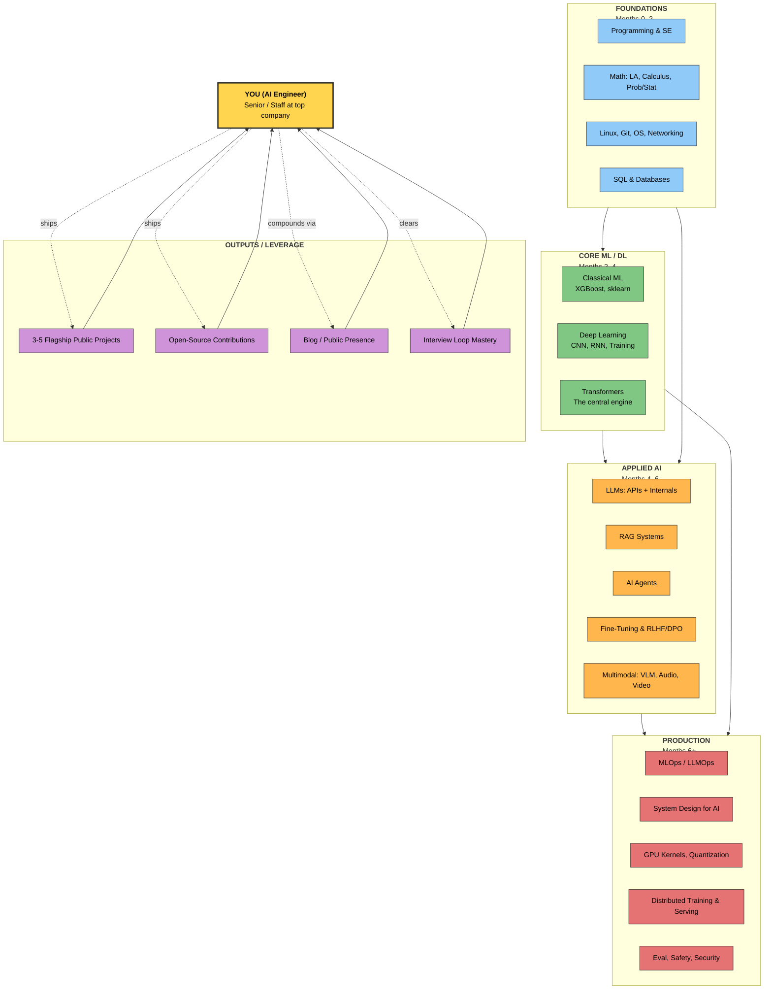

---

## 1. The Learning Path (How to Walk It)

What depends on what. **You must be solid on the boxes below a given box before you attempt it.** This is the dependency graph.

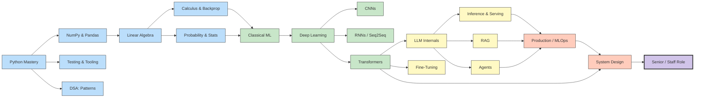

---

## 2. Foundations Map

The things you cannot skip. Each is a small dependency graph of its own.

```mermaid
graph TD
    subgraph COMPUTER["<b>How Computers Work</b>"]
        C1[Memory hierarchy] --> C2[CPU vs GPU vs TPU]
        C2 --> C3[Why GPUs dominate ML]
    end

    subgraph LINUX["<b>Linux / CLI</b>"]
        L1[Shell, pipes, grep, awk] --> L2[SSH, tmux, servers]
        L1 --> L3[Permissions & env vars]
    end

    subgraph GIT["<b>Git</b>"]
        G1[Branch, merge, rebase] --> G2[Interactive rebase]
        G2 --> G3[Clean history habits]
    end

    subgraph DSA["<b>Data Structures & Algorithms</b>"]
        D1[Arrays, hash maps] --> D2[Trees, heaps, tries]
        D1 --> D3[Graphs: BFS/DFS/Dijkstra]
        D2 --> D4[DP: 1D, 2D, on trees]
        D1 --> D5[Sorting, binary search]
        D3 --> D6[Contest-level problems]
    end

    subgraph DB["<b>Databases</b>"]
        DB1[PostgreSQL: joins, indexes, EXPLAIN] --> DB2[Transactions, isolation]
        DB1 --> DB3[Vector DBs: pgvector, Qdrant, Pinecone]
    end

    classDef block fill:#e3f2fd,stroke:#1976d2
    class C1,C2,C3,L1,L2,L3,G1,G2,G3,D1,D2,D3,D4,D5,D6,DB1,DB2,DB3 block
```

---

## 3. Math Prerequisite Map

The math you must own, with the order in which to learn it.

```mermaid
graph TD
    LA["<b>Linear Algebra</b><br/>30–50 hrs"]:::math
    CALC["<b>Multivariable Calculus</b><br/>20–30 hrs"]:::math
    PROB["<b>Probability & Statistics</b><br/>60–80 hrs"]:::math
    OPT["<b>Optimization</b><br/>20–30 hrs"]:::math
    NUM["<b>Numerical Computing</b><br/>10–20 hrs"]:::math

    LA --> CALC
    LA --> NUM
    CALC --> OPT
    PROB --> OPT
    LA --> PROB
    OPT --> LITMUS{ "<b>Litmus test</b><br/>Derive softmax cross-entropy<br/>forward + backward in NumPy<br/>with finite-difference check" }:::goal
    LA --> LITMUS
    PROB --> LITMUS
    NUM --> LITMUS

    classDef math fill:#b3e5fc,stroke:#01579b
    classDef goal fill:#fff176,stroke:#f57f17,stroke-width:3px
    class LA,CALC,PROB,OPT,NUM math
```

---

## 4. Classical ML Mental Model

The ML workflow, end to end, with the algorithms that go in each box.

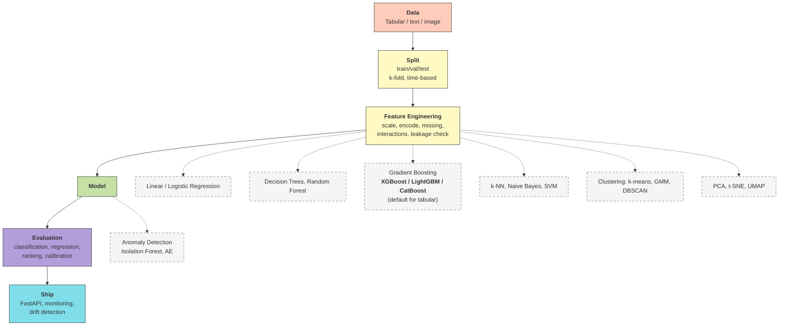

---

## 5. Deep Learning Architecture Map

The progression of architectures, with what each was solving.

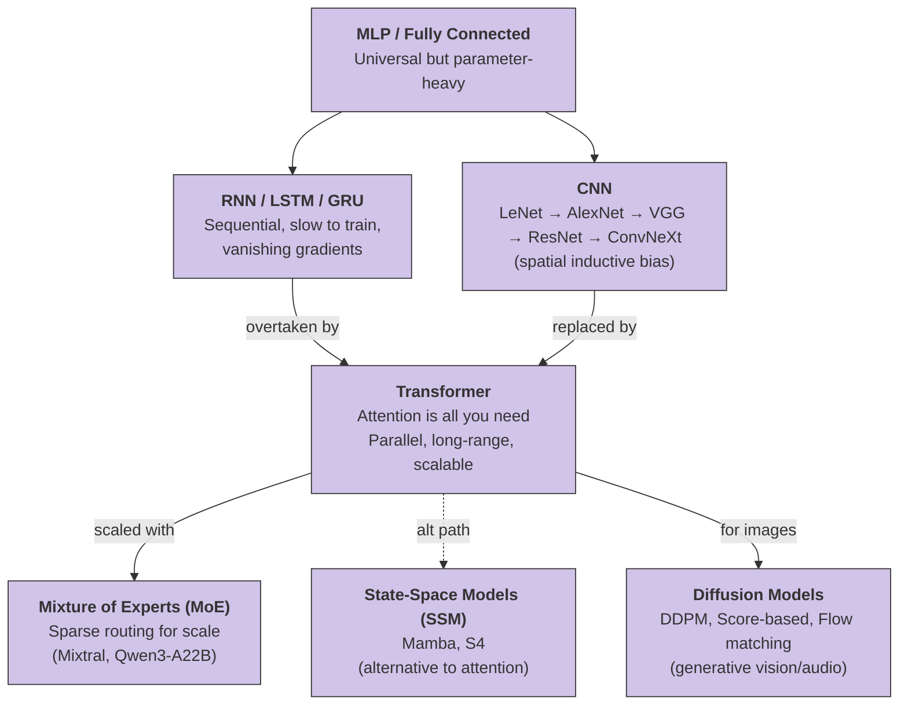

---

## 6. Transformer Anatomy (Single Block)

What is actually inside one decoder block. Memorize this.

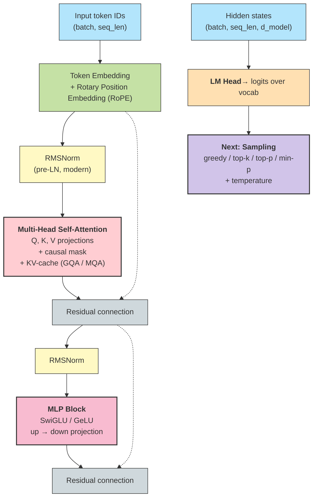

---

## 7. LLM Inference Flow

What happens when you call `client.chat.completions.create()`.

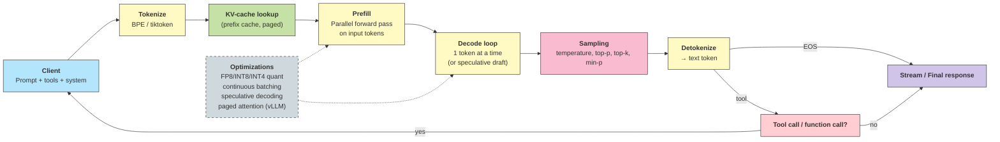

---

## 8. RAG System Map

The anatomy of a production RAG system.

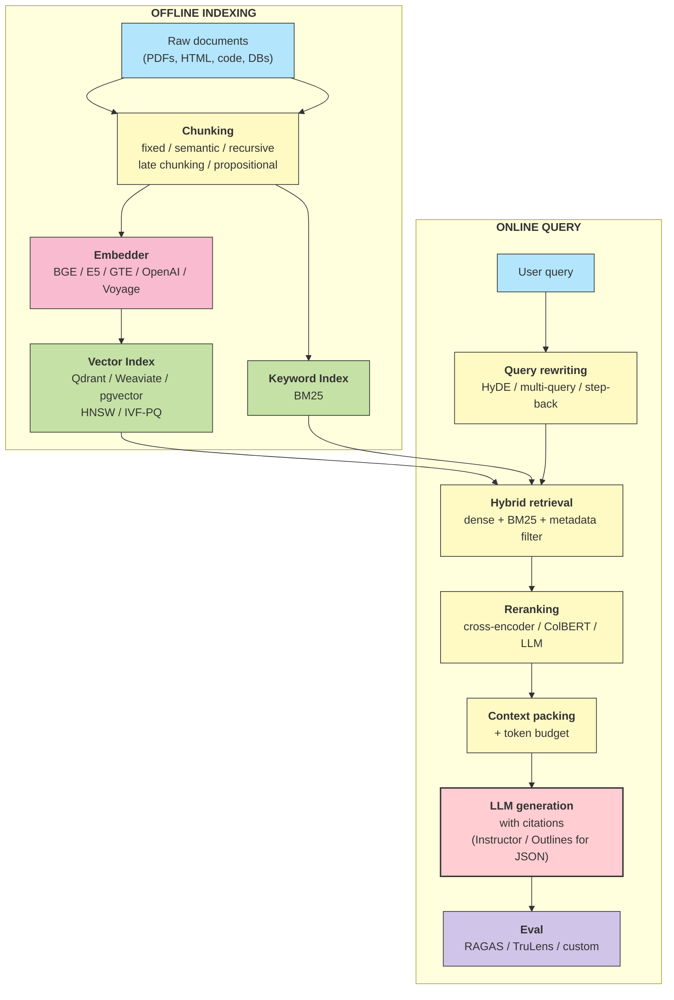

---

## 9. AI Agent Loop

The ReAct / tool-use pattern that powers modern agents.

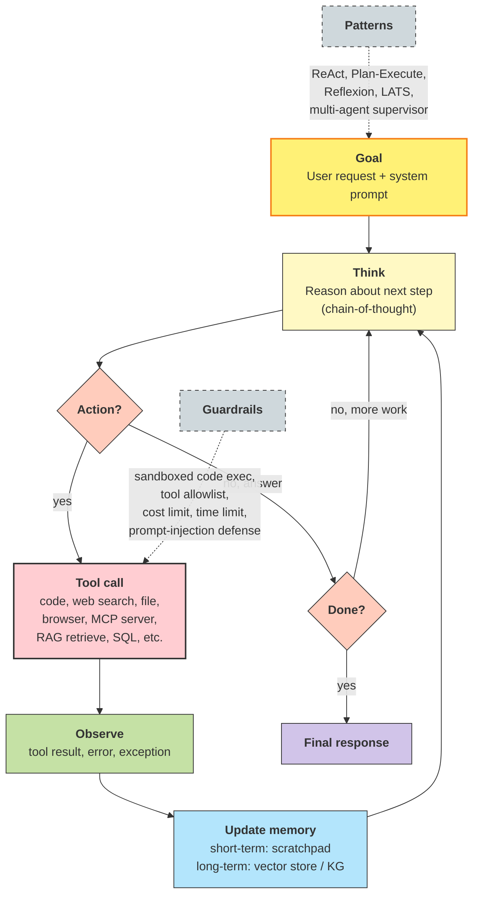

---

## 10. Fine-Tuning & Alignment Tree

How to specialize a base model.

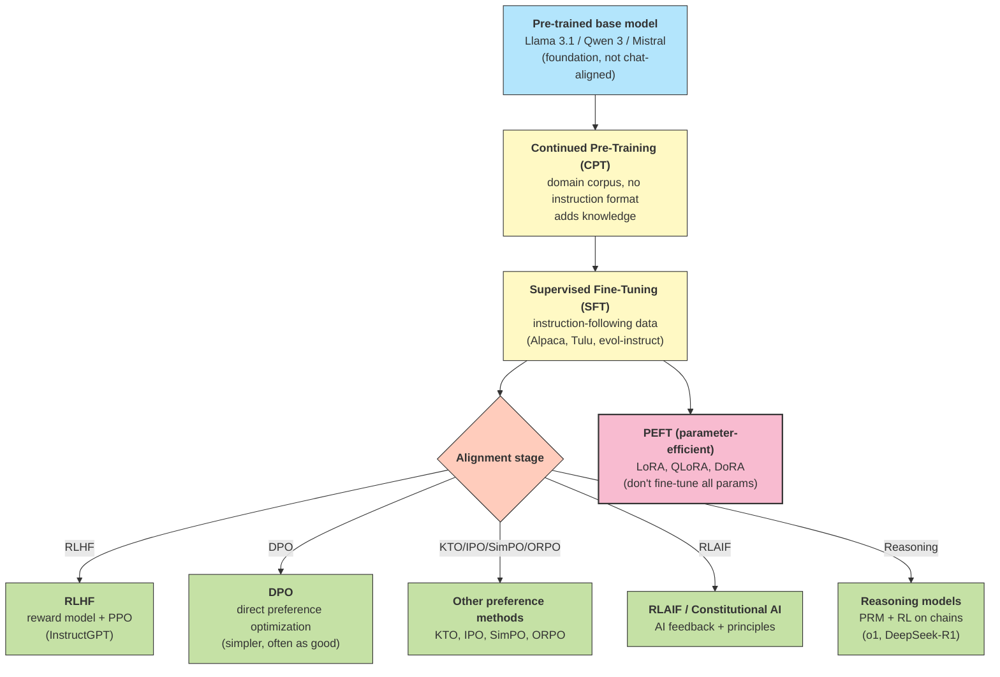

---

## 11. Multimodal AI Map

The architectures and tasks across vision, audio, video.

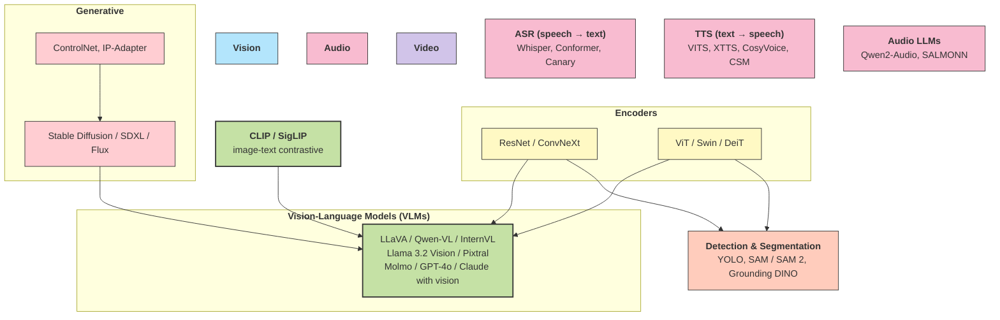

---

## 12. MLOps / LLMOps Production Stack

The layers between "model trained" and "system in production."

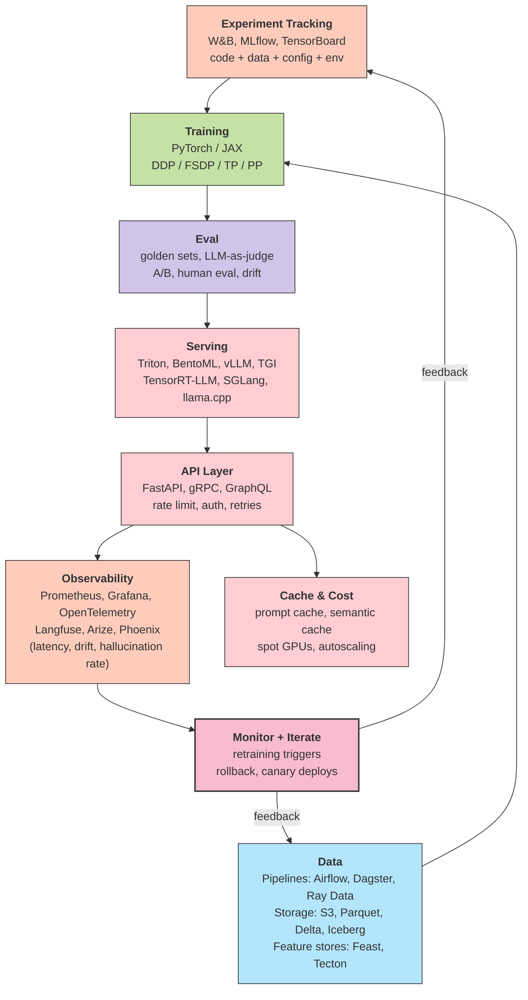

---

## 13. Distributed Training Strategies

How to scale training across many GPUs.

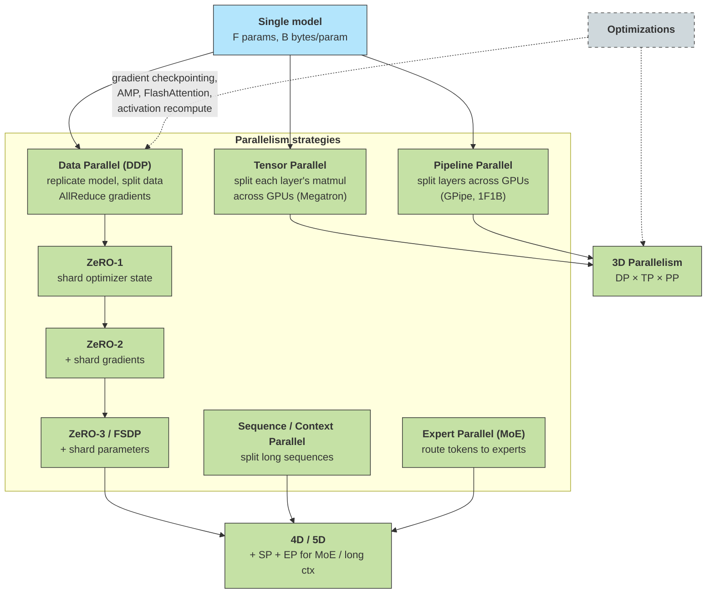

---

## 14. GPU Memory Hierarchy (Performance)

What the hardware looks like, and why kernel optimization matters.

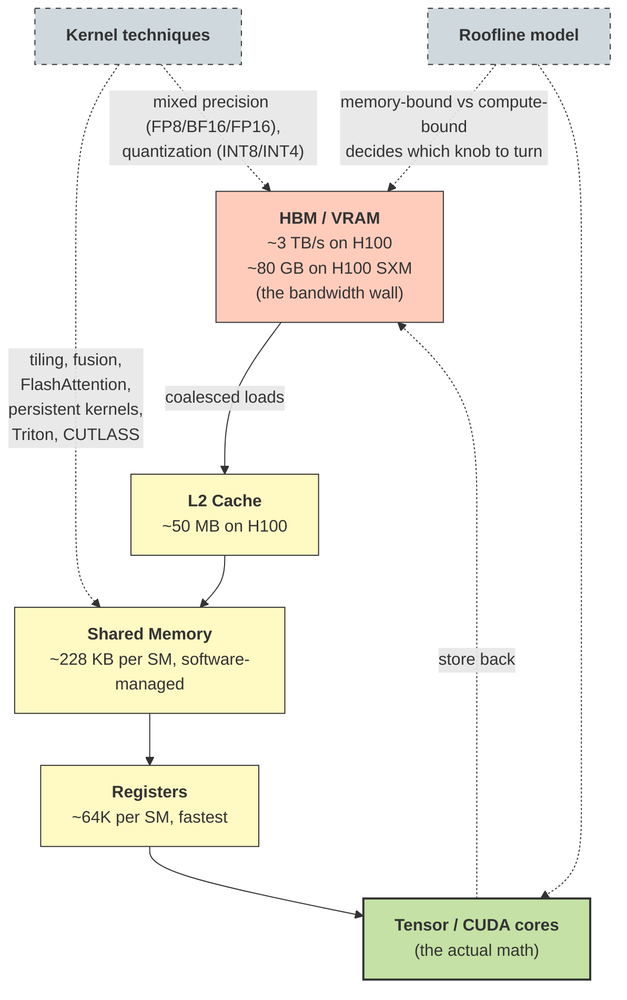

---

## 15. The AI Engineer Interview Loop

Verified June 2026: Anthropic and OpenAI process specifics.

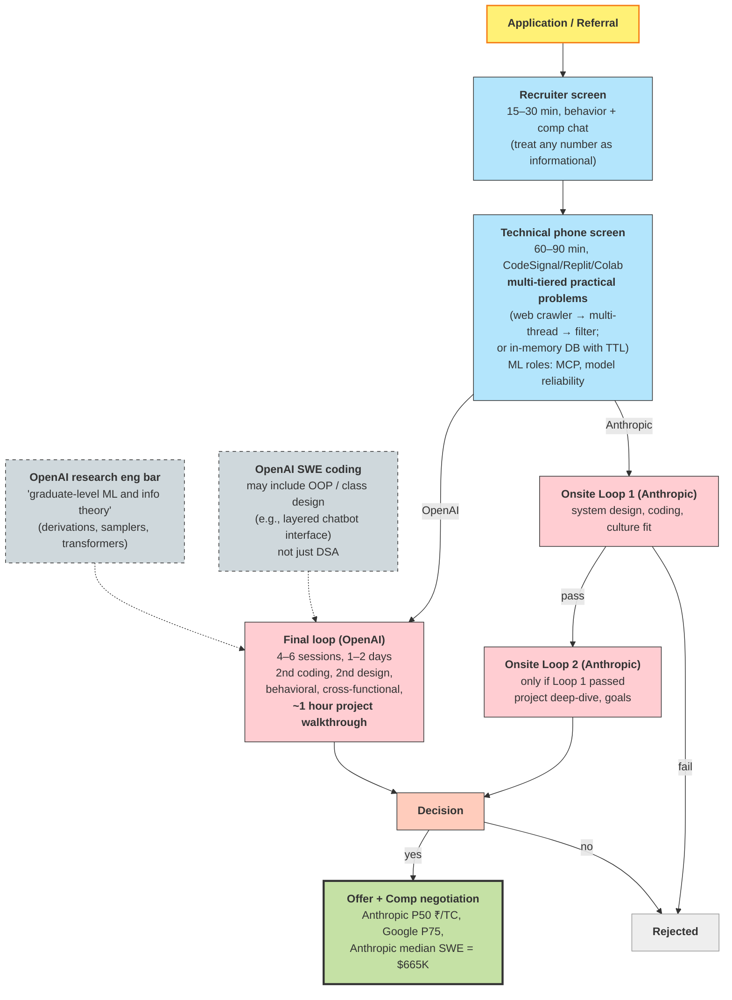

---

## 16. Project Portfolio Map

The 5 flagship projects that anchor a senior+ portfolio. Build in this order.

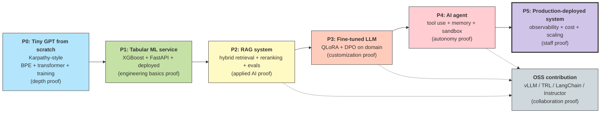

---

## 17. Compensation Strategy Tree (India)

Where you can land, what it pays, and how to move up.

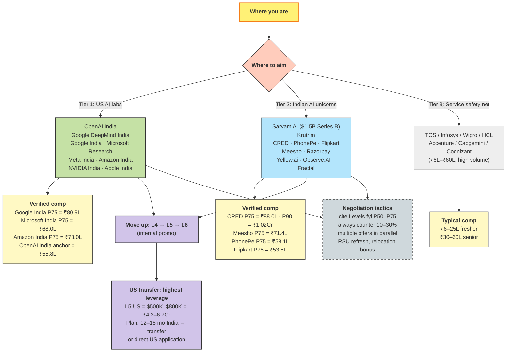

---

## 18. The Career-Compounding Loop

The positive-feedback cycle that turns senior engineers into staff+.

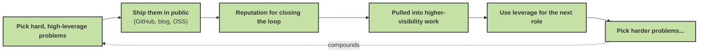

---

## 19. 24-Month Execution Flow

The phased plan, condensed.

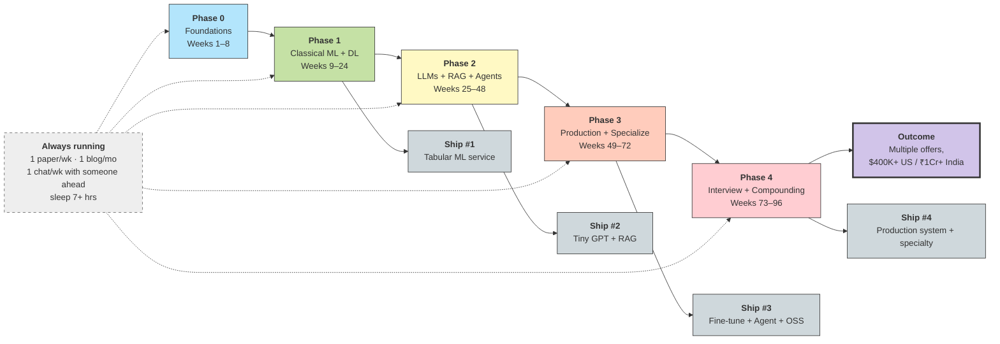

---

## How to Use These Maps

1. **Open the roadmap (`AI_ENGINEER_MASTERY_ROADMAP.md`) and this file side-by-side.** When you read a section, glance at the matching map first to anchor the mental model.
2. **Print the 24-Month Execution Flow and the Whole System map.** Pin them.
3. **Use the Foundation / DSA / Math maps to identify gaps.** Be honest — if you can't derive backprop on paper, the math map is calling.
4. **Use the Interview Loop map** during Weeks 22–24 of the 6-month plan to rehearse the actual flow.
5. **Use the Project Portfolio map** to track which flagships you have shipped.
6. **Use the India Compensation Tree** to plan your application strategy in months 5–6.

> These are living documents. As you learn, you will redraw them in your own words. That is the point.
